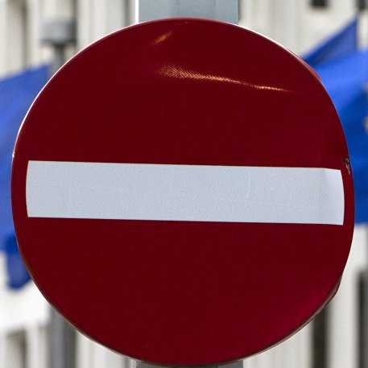
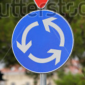
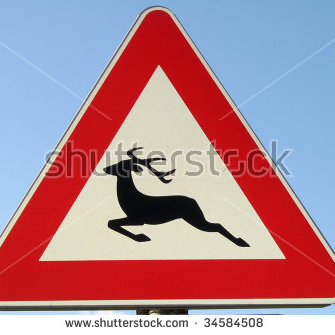
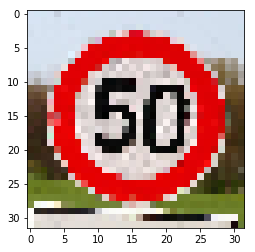
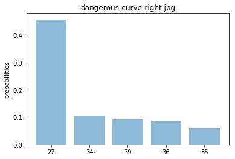

#**Traffic Sign Recognition** 

##Writeup Template

###You can use this file as a template for your writeup if you want to submit it as a markdown file, but feel free to use some other method and submit a pdf if you prefer.

---

**Build a Traffic Sign Recognition Project**

The goals / steps of this project are the following:
* Load the data set (see below for links to the project data set)
* Explore, summarize and visualize the data set
* Design, train and test a model architecture
* Use the model to make predictions on new images
* Analyze the softmax probabilities of the new images
* Summarize the results with a written report


[//]: # "Image References"

[image1]: ./output/class_histogram.png "Visualization"
[image2]: ./examples/grayscale.jpg "Grayscaling"
[image3]: ./examples/random_noise.jpg "Random Noise"
[sign1]: ./webimages/dangerous-curve-right.jpg "dang. curve right"
[sign2]: ./webimages/no-entry-for-vehicles.jpg "No Entry"
[sign3]: ./webimages/regulatory-sign-speed-limit-50-kmh-and-directional-sign-keep-off-the-EBKC62.jpg "Speed 50Km/h"
[sign4]: ./webimages/speedlimit20.jpg "Speed 20Km/h"
[sign5]: ./webimages/speedlimit30.jpg "Speed 30Km/h"
[sign6]: ./webimages/stock-photo-german-traffic-sign-bumpy-road-for-meters-415459579.jpg "bumpy roads"
[sign7]: ./webimages/stock-photo-triangle-and-roundabout-traffic-signs-at-circular-intersection-approach-241682995.jpg "round about"
[sign8]: ./webimages/wild-animal-crossing.jpg "Wild Animal Crossing"
[image9]: ./output/class_histogram_validation.png "Visualization"
[image10]: ./output/leftturn.png "Visualization of Sign"
[image11]: ./output/class_histogram_augment.png "Augmented Histogram"
[image12]: ./output/class_histogram_final.png "Final Histogram"
[image13]: ./output/29-bicyclecrossing.png "Visualization of Augmented Sign"
[image14]: ./output/loss.png "Training Loss"

## Rubric Points
###Here I will consider the [rubric points](https://review.udacity.com/#!/rubrics/481/view) individually and describe how I addressed each point in my implementation.  

---
###Writeup / README

####1. Provide a Writeup / README that includes all the rubric points and how you addressed each one. You can submit your writeup as markdown or pdf. You can use this template as a guide for writing the report. The submission includes the project code.

You're reading it! and here is a link to my [project code](https://github.com/suprnrdy/CarND-Traffic-Sign-Classifier-Project/blob/master/Traffic_Sign_Classifier.ipynb)

###Data Set Summary & Exploration

####1. Provide a basic summary of the data set. In the code, the analysis should be done using python, numpy and/or pandas methods rather than hardcoding results manually.

I used the numpy methods to calculate summary statistics of the traffic
signs data set:

* The size of training set is 34,799
* The size of the validation set is 4,410
* The size of test set is 12,630
* The shape of a traffic sign image is 32x32x3
* The number of unique classes/labels in the data set is 43


After Augmenting the training set I ended up with:

* We augmented 18 signs that had less than 1.7% occurences

* The size of augmented set is 14220

* Training set + augmented set is 49019

  ​

####2. Include an exploratory visualization of the dataset.

Here is an exploratory visualization of the data set. It is a histogram showing how the data count for each type of sign.  

![alt text][image1]

![alt text][image9]

![alt text][image10]


Looking at this histogram I determined that some signs would not be predicted very well, so I did a search for all images that represented less than 1.7% of the total set. These images were augmented with rotations and then added to the original training set. After this, the following histogram was generated along with an example of an image:

![alt text][image11]

![alt text][image12]

![alt text][image13]


###Design and Test a Model Architecture

####1. Describe how you preprocessed the image data. What techniques were chosen and why did you choose these techniques? Consider including images showing the output of each preprocessing technique. Pre-processing refers to techniques such as converting to grayscale, normalization, etc. (OPTIONAL: As described in the "Stand Out Suggestions" part of the rubric, if you generated additional data for training, describe why you decided to generate additional data, how you generated the data, and provide example images of the additional data. Then describe the characteristics of the augmented training set like number of images in the set, number of images for each class, etc.)

As a first step, I decided to convert the images to grayscale because this reduced the number of features that the network needed to train on, in turn speeding up the process.  

Here is an example of a traffic sign image before and after grayscaling.

![alt text][image2]

I then randomly flip the images and set a random brightness on each batch to help reduce overfitting of the model.  

Next, I normalized the image data to zero mean unit norm to help keep our gradients from going out of control.  By centering the data points and keeping the range constrained, we can help keep our training more stable. 

To help the network recognize patterns and edges better, I increased the contrast by 20%.  I did this because in the sample images I noticed some of the signs had very little contrast in them and with some testing was able to increase accuracy by increasing contrast.  

I noticed that even though accuracy was very high after training, certain signs were not being classified correctly.  When checking with the histogram of the training set, I could see that the same invalid predictions were related to those with very little samples in the training set, such as Speed limit 20Km/h or Dangerous curve right. If I were to augment the dataset, I would make a few copies of each image and run them through some filters such as blur, pixelate, and adjust the orientation of the images.

To accomplish this, I did checked the count for each sign and got the index of those with occurences less than 1.7%.  I then made a new array with every image that matched the signs I needed to augment such as Speed limit 20Km/h.  I made three batches, each rotating 90 degree from the previous, then concatenating them all to the oringal training set.  The statistics of the augmented data is cited earlier.  When comparing the original trainign set to the augmetned one, you can see a more evenly distributed set:

![alt text][image1]

 

![alt text][image12]

Given more time, I would have added more augmentations of these sets, such as Gaussian blur, Sharpen, Hue/color changes, etc…  


####2. Describe what your final model architecture looks like including model type, layers, layer sizes, connectivity, etc.) Consider including a diagram and/or table describing the final model.

My final model consisted of the following layers:

|        Layer        |               Description                |
| :-----------------: | :--------------------------------------: |
|        Input        |            32x32x3 RGB image             |
|  RGB-to-grayscale   |         32x32x1 Grayscale Image          |
|  Convolution1 5x5   | 1x1 stride, valid padding, outputs 28x28x30 |
|       Dropout       | Dropout keep_prob = 0.3 during training, 1 for validation/testing |
|  Convolution2 5x5   | 1x1 stride, valid padding, outputs 24x24x40 |
|       Flatten       |              Outputs 12000               |
|  Fully connected 1  |         Input 12000, output 200          |
|       Dropout       | Dropout keep_prob = 0.3 during training, 1 for validation/testing |
| Activation Function |                   Relu                   |
|  Fully connected 2  |          Input 200, output 100           |
|       Dropout       | Dropout keep_prob = 0.3 during training, 1 for validation/testing |
| Activation Function |                   Relu                   |
|  Fully connected 3  |        Input 100, Logit output 43        |


####3. Describe how you trained your model. The discussion can include the type of optimizer, the batch size, number of epochs and any hyperparameters such as learning rate.

To train the model, I used the LeNet model as a baseline.  With some tweaking and testing, my final model ended with:

* 17 EPOCHS

* Learning rate of 0.0005

* Batch size of 128

* Dropout keep probability of 0.3

* Added a third convolutional layer before the first Fully connected layer

* Modified the depth of each layer

* Preprocesed each image to grayscale with more contrast.

  ​

####4. Describe the approach taken for finding a solution and getting the validation set accuracy to be at least 0.93. Include in the discussion the results on the training, validation and test sets and where in the code these were calculated. Your approach may have been an iterative process, in which case, outline the steps you took to get to the final solution and why you chose those steps. Perhaps your solution involved an already well known implementation or architecture. In this case, discuss why you think the architecture is suitable for the current problem.


To train the model, I used the LeNet model as a baseline.  My approach was to get the highest accuracy rate on the training and validation sets, then fix the overfitting problem.  The first modification I did was to turn the images into grayscale and normalized them.  This gave a significant boost in performance and accuracy. The sample images of some signs had very low contrast, making it harder for the network to detect edges and shapes. Increasing the contrast of the grayscale images helped give a decent boost in accuracy.  I then ran the test at increased intervals of EPOCHS until the accuracy gain plateaued.  With the EPOCHS set, the learning rate was adjusted to 0.0005.  This allowed for less overshooting and a more stable system.  At this point I was reaching ~93% accuracy in the validation set, but only about 91-92% in the test set.  It was time to make modifications to the various layers.  Playing around with the depth of the convolutional layers helped a bit, but I was not able to get it past 94.5% with the validation set and an even worse 91% on the training set.  At this point, I attempted to add an additional convolutional layer and reached an extremely high accuracy rate.  After more tweaking, I was able to get the final accuracy to: 

```
EPOCH 17 ...
training loss = 0.015
validation loss = 0.057
training Accuracy = 0.998
validation Accuracy = 0.985
```

Looking at the loss graph, I was confident that I was not overfitting and ran through enough EPOCHS.

![alt text][image14]


My final model results were:

* training set accuracy of 99.8%
* validation set accuracy of 98.5%
* test set accuracy of 95.7%

The way I was able to tell my model was overfitting was my test set accuracy was much lower.  To fix this, I removed the Pooling in the original architecture and added in dropout layers.  Through research, it's understood that by removing random nodes and zeroing them out, the model can better train on the remaining nodes. Because each round we make changes, we learn a little bit more about the importance of various features.  

To reduce overfitting, we also randomly rotate the images and adjust the brightness. This prevents the model from memorizing specific patterns and forces it to focus on the important pieces.  


###Test a Model on New Images

####1. Choose five German traffic signs found on the web and provide them in the report. For each image, discuss what quality or qualities might be difficult to classify.

Here are 8 German traffic signs that I found on the web:









The wild animal image may be hard to classify because it's very similar to bike crossing when the image is scaled down to 32x32 and pixelated.  Also the 20Km/h sign would have been hard to predict because there were so few samples.  The right dangerous right turn ahead could be difficult to classify because the angle of the sign may be different from what the classifier has been trained on.  Below are the images resized to 32x32x3 to give us an idea of what we'll be trying to classify.  





####2. Discuss the model's predictions on these new traffic signs and compare the results to predicting on the test set. At a minimum, discuss what the predictions were, the accuracy on these new predictions, and compare the accuracy to the accuracy on the test set (OPTIONAL: Discuss the results in more detail as described in the "Stand Out Suggestions" part of the rubric).

Here are the results of the prediction:

|         Image         |    Prediction     |
| :-------------------: | :---------------: |
|        20 km/h        |      20 km/h      |
| Wild Animal Crossing  | Bicycles Crossing |
|       No Entry        |     No Entry      |
| Dangerous Right Curve |    Bumpy Road     |
|        30 km/h        |      30 km/h      |
|        50 km/h        |      50 km/h      |
|      Bumpy Road       |    Bumpy Road     |
|      Roundabout       |    Roundabout     |


The model was able to correctly guess 6 of the 8 traffic signs, which gives an accuracy of 75%. This is lower than the test accuracy measured.  Originally before augmenting the data, the 20 km/h and dangerous right curve were being classified incorrectly.  Now the Dangerous Curve and wild animal crossing are being classified incorrectly.  This may be to the fact that the augmented data has similar features between the two.  

####3. Describe how certain the model is when predicting on each of the five new images by looking at the softmax probabilities for each prediction. Provide the top 5 softmax probabilities for each image along with the sign type of each probability. (OPTIONAL: as described in the "Stand Out Suggestions" part of the rubric, visualizations can also be provided such as bar charts)

The code for making predictions on my final model is located in the 17th cell of the Ipython notebook.

For the first image, the model is relatively sure that this is a 20 km/h sign (probability of 0.34), and the image does contain this sign. The top five soft max probabilities were

| Prediction  | Probability |
| :---------: | :---------: |
|   20 km/h   |     .34     |
|   80 km/h   |     .19     |
|   70 km/h   |     .18     |
|   30 km/h   |     .12     |
| End 80 km/h |     .05     |


For the second image, the model is very sure that this is a Bicycles Crossing sign (probability of 0.85), but the actual sign is Wild Animal Crossings. The top five soft max probabilities were

|      Prediction       | Probability |
| :-------------------: | :---------: |
|   Bicycles Crossing   |     .85     |
| Wild Animals Crossing |     .06     |
|       Road Work       |     .03     |
|  Road Narrows Right   |     .01     |
|   Children Crossing   |    .008     |


For the third image, the model is very sure that this is a No Entry sign (probability of 1.0), which is correct. The top five soft max probabilities were

|             Prediction              | Probability |
| :---------------------------------: | :---------: |
|              No Entry               |     1.0     |
|                Stop                 |     ~0      |
| End of all speed and passing limits |     ~0      |
|        Go straight or right         |     ~0      |
|             Bumpy road              |     ~0      |


For the fourth image, the model is sure that this is a Bumpy Road sign (probability of 0.45), but the actual sign is Dangerous curve right. The top five soft max probabilities were

|      Prediction      | Probability |
| :------------------: | :---------: |
|      Bumpy Road      |     .45     |
|   Turn left ahead    |     .10     |
|      Keep left       |     .09     |
| Go straight or right |     .08     |
|      Ahead only      |     .05     |




For the fifth image, the model is very sure that this is a30km/h sign (probability of 0.99), and is correct. The top five soft max probabilities were

| Prediction | Probability |
| :--------: | :---------: |
|  30 km/h   |     .99     |
|  50 km/h   |     ~0      |
|  70 km/h   |     ~0      |
|  80 km/h   |     ~0      |
|  20 km/h   |     ~0      |


For the sixth image, the model is very sure that this is a 50 km/h sign (probability of 0.99), and is correct. The top five soft max probabilities were

|      Prediction      | Probability |
| :------------------: | :---------: |
|       50 km/h        |     .99     |
|       30 km/h        |     ~0      |
|       80 km/h        |     ~0      |
|       60 km/h        |     ~0      |
| Wild animal crossing |     ~0      |


For the seventh image, the model is very sure that this is a Bumpy Road sign (probability of 1.0), and is correct. The top five soft max probabilities were

|        Prediction         | Probability |
| :-----------------------: | :---------: |
|        Bumpy Road         |     1.0     |
| Road narrows on the right |     ~0      |
|         Road Work         |     ~0      |
|     Bicycles Crossing     |     ~0      |
|         No Entry          |     ~0      |


For the eighth image, the model is very sure that this is a Roundabout sign (probability of 0.99), and is correct. The top five soft max probabilities were

|           Prediction           | Probability |
| :----------------------------: | :---------: |
|           Roundabout           |     .99     |
|         Priority Road          |     ~0      |
|            100 km/h            |     ~0      |
|            20 km/h             |     ~0      |
| Right of way next intersection |     ~0      |


### (Optional) Visualizing the Neural Network (See Step 4 of the Ipython notebook for more details)
####1. Discuss the visual output of your trained network's feature maps. What characteristics did the neural network use to make classifications?


